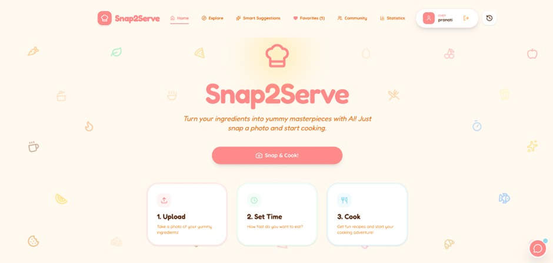
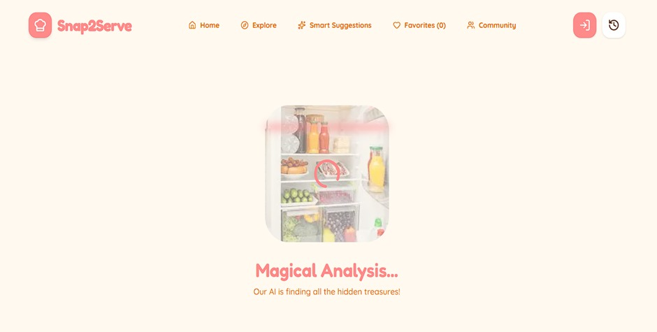
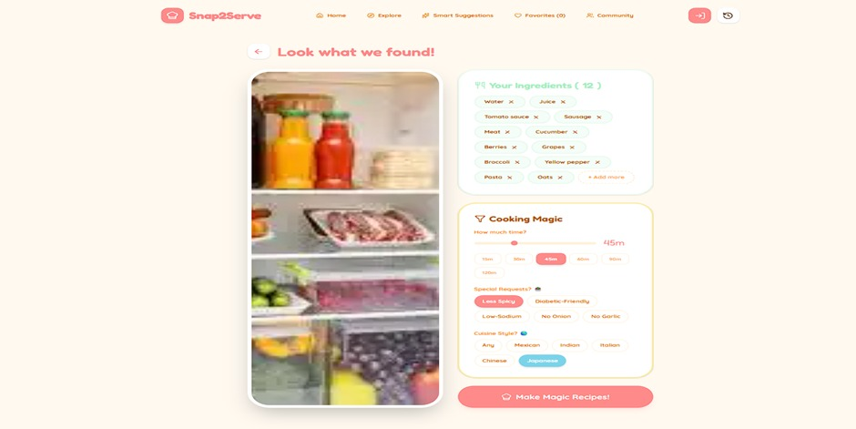
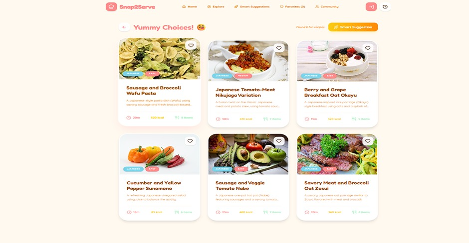
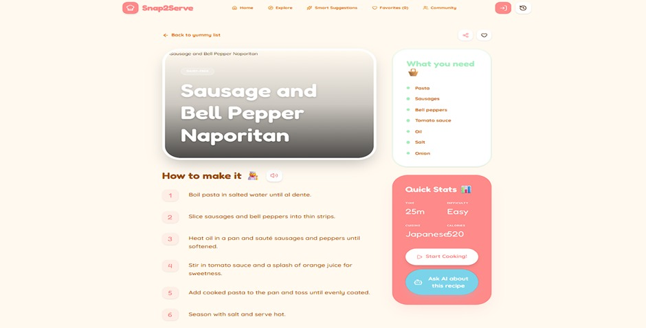
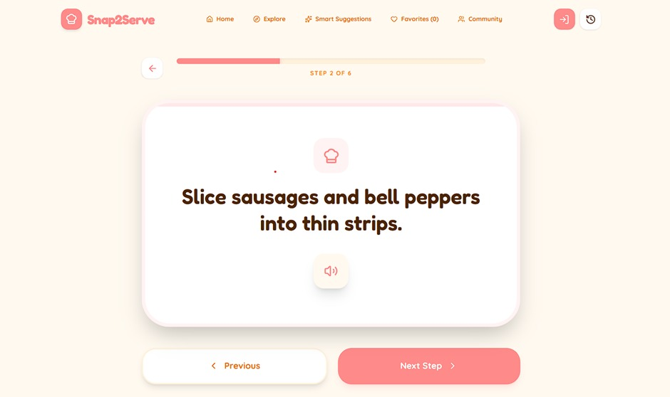
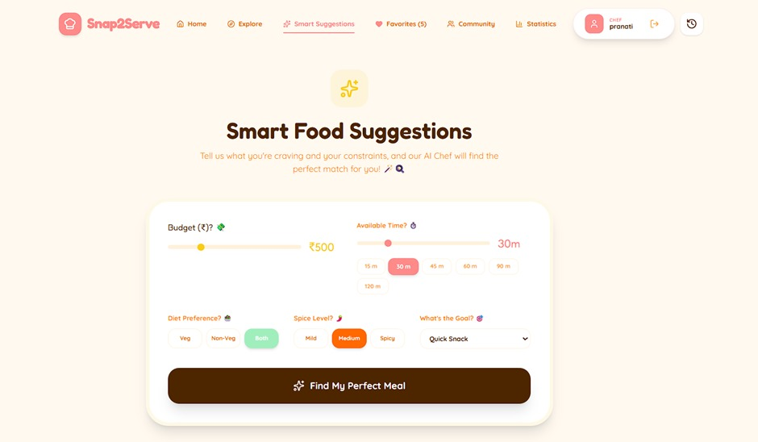
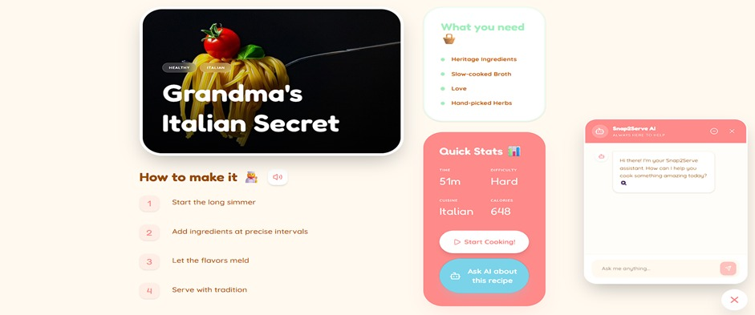
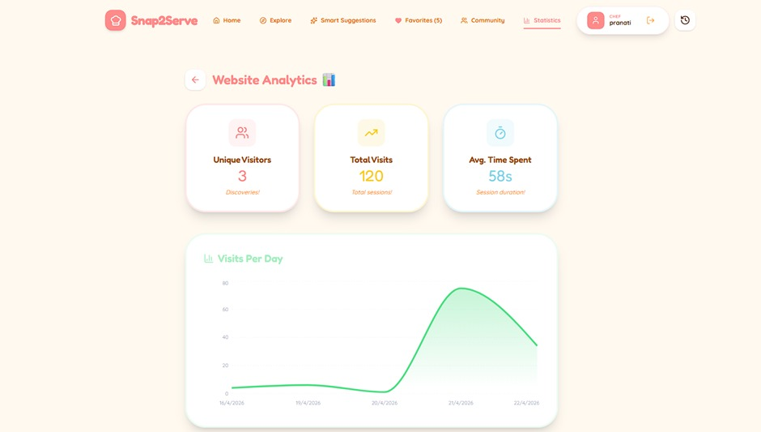

# Snap2Serve_mini-project
AI-Based Recipe Recommendation Web Application

# About the Project
This project is a web application that recommends cooking recipes based on ingredients available with the user and the time limit provided.
Users upload images of ingredients, and the system uses AI to detect them and generate suitable recipes using Large Language Models and an AI agent.
The application helps users save time, reduce food wastage, and make quick cooking decisions. 

# Problem Statement
Users often find it difficult to decide what to cook with limited ingredients and time. 
Existing platforms require manual ingredient input and lack intelligent personalization. 
This project addresses these issues using image-based ingredient detection and AI-driven recipe generation. 

# Project Screenshots

  
  
  
  
  
  
  
  
  

# Technologies Used
Frontend: React.js 
Backend: Node.js, Express.js 
Database: MongoDB 
AI: Image recognition model, Large Language Models (LLMs), AI agent 

# Working 
User uploads ingredient images and enters cooking time. 
AI detects ingredients from the images. 
An AI agent applies constraints such as time and preferences. 
LLM generates suitable recipes. 
Recipes are displayed to the user for selection and sharing. 

# Features
1.Image-based ingredient detection 
2.Time-based recipe recommendation 
3.AI-powered recipe generation 
4.Multi-recipe comparison 
5.Cuisine and regional adaptation 
6.Step-by-step cooking mode 
7.Voice-based instructions 
8.Difficulty level indication 
9.Dietary preference and allergy filtering 
10.Favorites, history, and recipe sharing 
11.AI chatbot assistant 

# Advantages
-Saves time and effort 
-Reduces food wastage 
-Personalized recommendations 
-Easy and user-friendly interface

# Stakeholders
- End Users: Use the app to find and cook recipes  
- AI System: Detects ingredients and generates recipes  
- Developers: Build and maintain the application  
- System Administrator: Ensures smooth operation  
- Database: Stores user data and recipes  
- Cloud Provider: Hosts the application  
